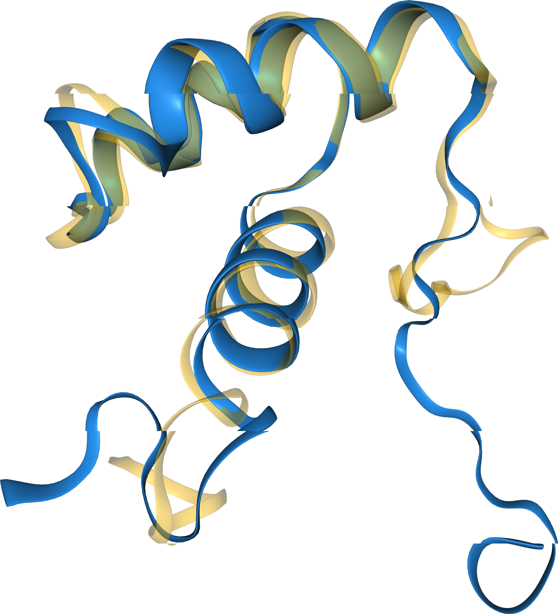
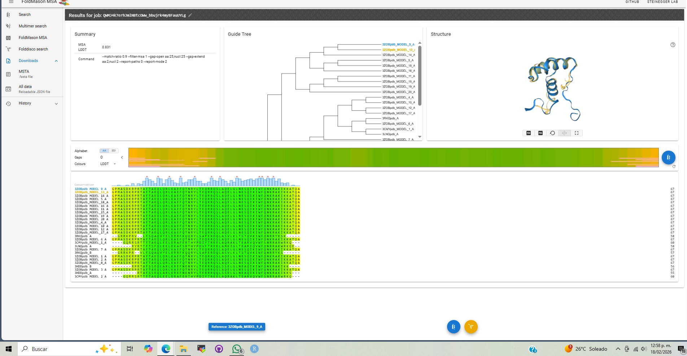

# Ejericio 2: Análisis Estructural de Dominios – CATH y FoldMason

## 1. Introducción

En esta actividad se analizaron dominios pertenecientes a la
superfamilia **Homeodomain (CATH 1.10.10.60)**. El objetivo fue evaluar
la conservación estructural mediante alineamiento múltiple y búsqueda
estructural en bases de datos.

**Dominios seleccionados:**

-   3LNQ (Cadena A)
-   3CMY (Cadena A)
-   3HDD (Cadena A)
-   3RKQ (Cadena A)
-   3ZOB (Cadena A)

Todos corresponden a factores de transcripción tipo homeodominio.

------------------------------------------------------------------------

## 2. Alineamiento Estructural (FoldMason)

Se realizó un alineamiento múltiple estructural (MSTA) utilizando
FoldMason para superponer los dominios seleccionados.

### Superposición 3D

### Alineamiento de Secuencia (MSA)

El alineamiento mostró una alta conservación en las regiones
correspondientes a las hélices alfa características del dominio
homeodomain.

------------------------------------------------------------------------

## 3. Búsqueda de Similitud (Foldseek)

Las estructuras alineadas se enviaron a Foldseek y se realizó la
búsqueda contra la base de datos **PDB100**.

Los primeros resultados fueron:

| Target (ID)      | Descripción                       | Prob. | Seq. Id (%) | E-Value |
|------------------|-----------------------------------|:-----:|:-----------:|:-------:|
| 1enh-assembly1_A | Engrailed homeodomain             | 1.00  |    79.6     | 2.20e-5 |
| 1pf3-assembly1_A | Engrailed homeodomain mutant K52A | 1.00  |    77.3     | 2.51e-5 |
| 1pf7-assembly1_D | Engrailed homeodomain mutant K52A | 1.00  |    76.7     | 1.47e-5 |
| 3hdd-assembly1_E | Engrailed homeodomain DNA complex | 1.00  |    80.3     | 3.51e-5 |
| 3hdd-assembly1_B | Engrailed homeodomain DNA complex | 1.00  |    78.5     | 3.51e-5 |

Los valores de probabilidad iguales a 1.00 y los E-values bajos indican
coincidencias estructurales altamente significativas. La identidad de
secuencia (\~75–80%) confirma la fuerte conservación evolutiva dentro de
la familia.

------------------------------------------------------------------------

## 4. Análisis de RMSD e Identidad

Utilizando el script
[prog3.1.py](https://github.com/eead-csic-compbio/bioinformatica_estructural/blob/master/code/prog3.1.py)
junto con los archivos `foldmason.pdb` y `foldmason_aa.fa`, se
calcularán el porcentaje de identidad y el RMSD para parejas
representativas de estructuras superpuestas.

El archivo `foldmason_aa.fa` contiene únicamente dos secuencias, por lo
que el análisis se realizó entre estas dos estructuras.

Los resultados obtenidos fueron:

| Estructuras comparadas | Total de residuos | Total de residuos alineados | RMSD (Å) |
|----|----|----|----|
| 3ZOB_A (Modelo 9) vs 3ZOB_A (Modelo 13) | 67 | 67 | 5.52 |

El porcentaje de identidad es del 100 %, lo que indica que ambas
estructuras corresponden a la misma secuencia. Sin embargo, el valor de
RMSD (5.52 Å) indica diferencias conformacionales apreciables entre los
modelos comparados.

Esto sugiere que, aunque la secuencia es idéntica, pueden existir
variaciones estructurales debidas a diferencias en el modelo,
condiciones experimentales o flexibilidad intrínseca del dominio.

------------------------------------------------------------------------

## 5. Conclusiones

El análisis estructural de dominios homeodomain pertenecientes a la
superfamilia CATH 1.10.10.60 confirmó una alta conservación estructural
entre los miembros seleccionados.

El alineamiento estructural múltiple realizado con FoldMason mostró una
superposición clara de las tres hélices alfa características del
homeodominio, evidenciando la conservación del motivo estructural
hélice–giro–hélice.

La búsqueda con Foldseek arrojó probabilidades de 1.00 y E-values bajos,
lo que confirma la fuerte similitud estructural con otros homeodominios
depositados en PDB100. Además, los valores de identidad de secuencia
(\~75–80 %) indican una conservación evolutiva significativa dentro de
esta familia.

Finalmente, el cálculo del RMSD mediante el script prog3.1.py demostró
que incluso estructuras con identidad de secuencia del 100 % pueden
presentar diferencias conformacionales detectables. Esto resalta la
importancia del análisis estructural tridimensional más allá de la
comparación de secuencias.

En conjunto, los resultados confirman que la estructura está más
conservada que la secuencia dentro de esta superfamilia proteica.
