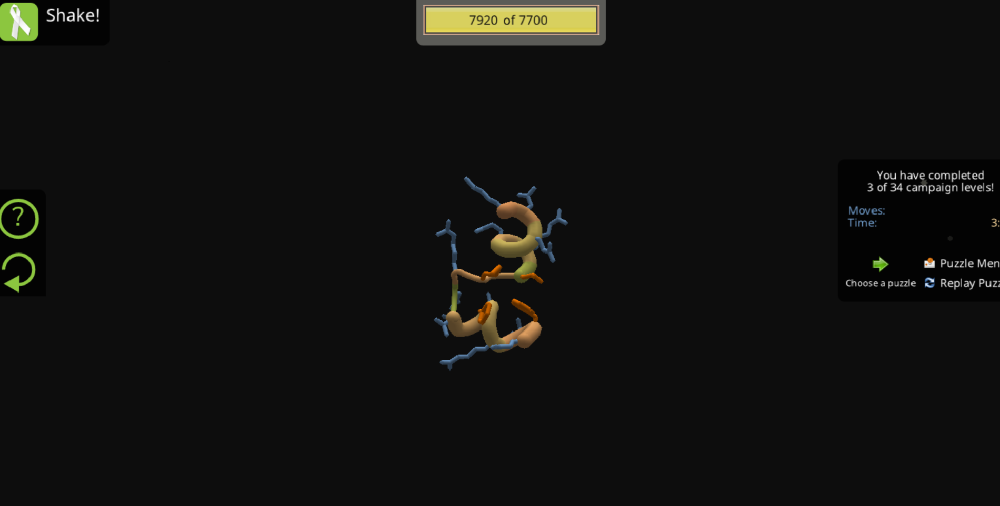
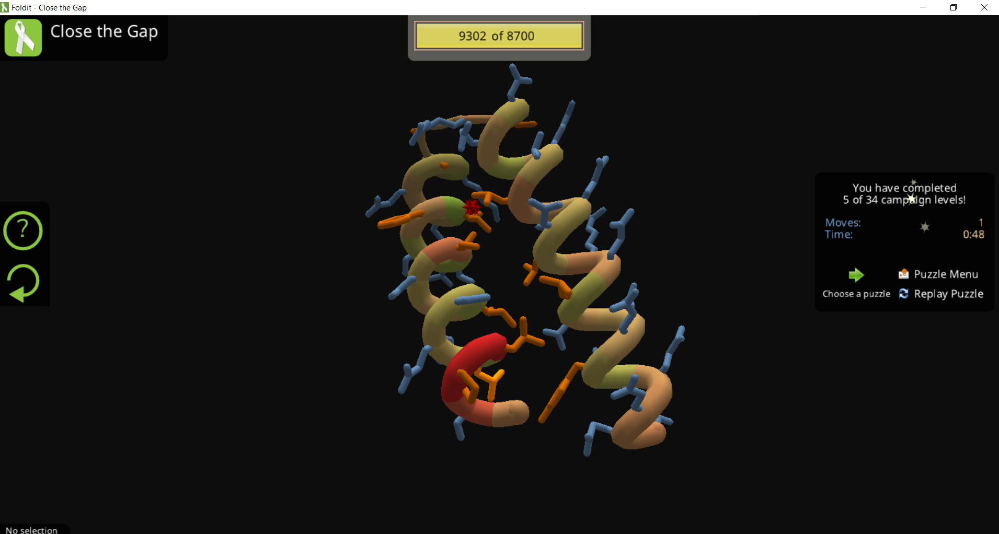

# PRÁCTICA DE JUEGO FOLDIT 

**Figura 1.** Optimización manual de una estructura proteica en Foldit. Se visualizan los aminoácidos y las herramientas de ajuste utilizadas para mejorar el empaquetamiento molecular.

**Figura 2.** Análisis conformacional de una proteína mediante la plataforma Foldit. La imagen muestra el proceso de optimización estructural, donde se busca alcanzar el estado de mínima energía libre (máximo score) a través de la reducción de choques estéricos y la maximización de interacciones favorables en el núcleo hidrofóbico.

