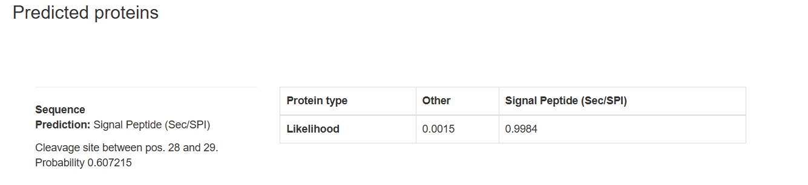
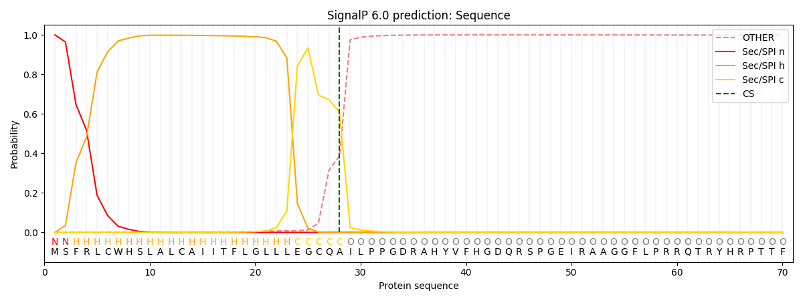

# EVALUACIÓN ESTRUCTURAL INTEGRADA 

La proteína PFH55053, anotada como enterotoxina putativa, fue modelada estructuralmente utilizando AlphaFold2 debido a la ausencia de una estructura experimental disponible. Posteriormente, se evaluó la calidad del modelo mediante Swiss-Model Structure Assessment y se analizó la presencia de un péptido señal utilizando SignalP 6.0. El objetivo fue integrar evidencia estructural y funcional para determinar la confiabilidad del modelo predicho.

### Resultados de AlphaFold2

**pLDDT (Predicted Local Distance Difference Test)**

El perfil de pLDDT mostró valores moderados en el núcleo central de la proteína y valores más bajos en la región N-terminal. Esto sugiere que el dominio central posee mayor confiabilidad estructural, mientras que el extremo N-terminal presenta mayor incertidumbre, posiblemente asociada a flexibilidad o falta de restricción evolutiva.

**pTM (Predicted TM-score)**

El valor de pTM (~0.8) indica una buena coherencia global del plegamiento predicho. Esto sugiere que la arquitectura tridimensional general del dominio estructurado es consistente y no aleatoria.

**PAE (Predicted Aligned Error)**

El mapa de error alineado muestra menor error en el dominio central y mayor incertidumbre en regiones terminales. Esto respalda la hipótesis de que la proteína posee un núcleo estructural estable acompañado de segmentos periféricos más flexibles.

**Conclusión de AF2:**
AlphaFold2 predice un dominio globular central estructuralmente coherente, con regiones terminales de menor confiabilidad.

## Evaluación estructural con Swiss-Model

**Análisis de Ramachandran**

El diagrama de Ramachandran muestra que la mayoría de los residuos se encuentran en regiones favorecidas o permitidas, lo que indica que la geometría del esqueleto peptídico es estereoquímicamente aceptable. No se observan desviaciones severas que comprometan la plausibilidad estructural.

**MolProbity**

El puntaje MolProbity (~2.98) indica buena calidad geométrica para un modelo predictivo. Este valor sugiere ausencia de conflictos estéricos severos y una conformación razonable de ángulos torsionales y rotámeros.

**QMEANDisCo**

El Z-score global de QMEAN (–4.06) indica que el modelo se desvía de las características estadísticas típicas de estructuras experimentales del PDB. Los términos más afectados corresponden a torsión y solvatación, lo que sugiere posibles regiones extendidas, poco compactas o flexibles.

**Conclusión de Swiss:**
Aunque la estereoquímica del modelo es aceptable, el comportamiento estadístico global no es equivalente al de una estructura cristalográfica compacta.

## Análisis funcional con SignalP 6.0

SignalP 6.0 predice con alta probabilidad (Likelihood = 0.9984) la presencia de un péptido señal tipo Sec/SPI en el extremo N-terminal, con un sitio de corte entre los residuos 28 y 29.

Esto implica que:

Los primeros 28 residuos corresponden a un péptido señal de secreción.

Esta región no forma parte del dominio estructural maduro.

El péptido señal es removido tras el proceso de secreción.

La presencia de esta región transitoria explica:

Valores bajos de pLDDT en el N-terminal.

Penalización en el componente torsional de QMEAN.

Desviaciones en solvatación.

Regiones extendidas observadas en el modelo.

## Interpretación integrada

La baja puntuación global de QMEAN (–4.06) probablemente está influenciada por la inclusión del péptido señal N-terminal en el modelo estructural completo. Dado que esta región no forma parte del dominio maduro y no está destinada a plegarse como estructura globular estable, su presencia afecta negativamente las métricas estadísticas globales.

Al considerar que el dominio estructural maduro inicia en el residuo 29, la evaluación del núcleo central resulta coherente entre AlphaFold2 y Swiss-Model:

AF2 indica un plegamiento global consistente (pTM ~0.8).

Ramachandran y MolProbity confirman geometría aceptable.

QMEAN penaliza principalmente regiones flexibles o transitorias.

**Esto sugiere que el núcleo estructural es plausible, mientras que las regiones terminales deben interpretarse con cautela.**

## Conclusión final

El modelo predicho por AlphaFold2 para PFH55053 es estructuralmente plausible en su dominio central y presenta estereoquímica aceptable según Swiss-Model. Las desviaciones globales detectadas por QMEAN están probablemente asociadas a la presencia de un péptido señal y a regiones potencialmente flexibles.

Por lo tanto, la interpretación estructural y funcional debe centrarse en el dominio maduro (residuos 29 en adelante), mientras que las regiones terminales deben considerarse con precaución.