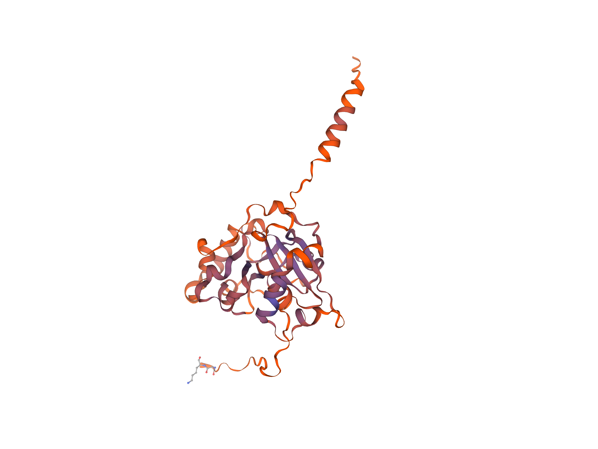
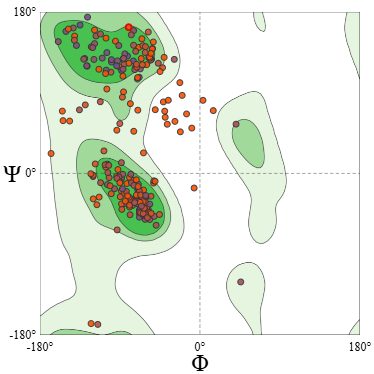
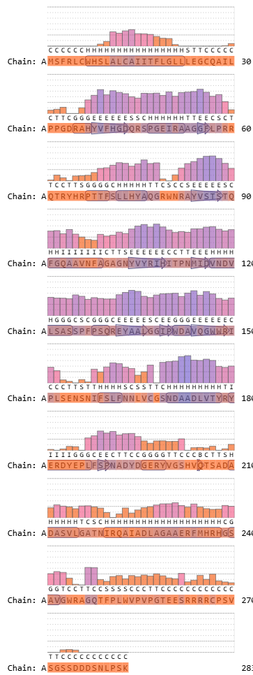
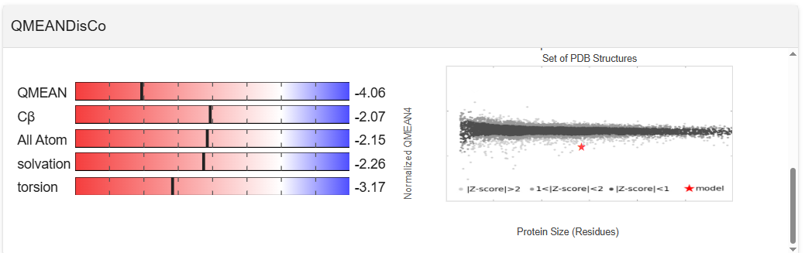

# Swiss-Model Structure Assessment Report

## Descripción general de la estructura

La estructura predicha muestra un núcleo globular compuesto principalmente por hélices α y láminas β, con regiones extendidas en los extremos N- y C-terminal.

La visualización 3D indica:

El modelo presenta un dominio globular central y extensiones terminales. La arquitectura sugiere un core estructural estable y regiones potencialmente flexibles/desordenadas, lo cual es consistente con la variación esperada en confianza local

## Ramachandran 

La ocupación mayoritaria en regiones favorecidas indica una geometría backbone compatible con proteínas nativas. Los outliers  deben revisarse en el contexto de su ubicación: bucles, terminales o regiones de baja confianza suelen concentrar desviaciones.

# Aligments

El alineamiento y anotación de estructura secundaria sugieren un dominio central con elementos secundarios consistentes, mientras que segmentos terminales presentan mayor proporción de coil, compatible con flexibilidad estructural.

# QMEANDisCo 

El Z-score global de QMEAN (–4.06) indica que el modelo se desvía de manera significativa de las características estadísticas observadas en estructuras proteicas determinadas experimentalmente. Aunque algunos componentes geométricos individuales, como Cβ y las interacciones all-atom, se encuentran moderadamente afectados, los términos de torsión y solvatación muestran desviaciones más pronunciadas. Esto sugiere que, si bien la geometría del esqueleto peptídico es en general aceptable (como lo respalda el análisis de MolProbity), el modelo probablemente contiene regiones extendidas o con empaquetamiento deficiente, que podrían corresponder a segmentos flexibles o intrínsecamente desordenados.

