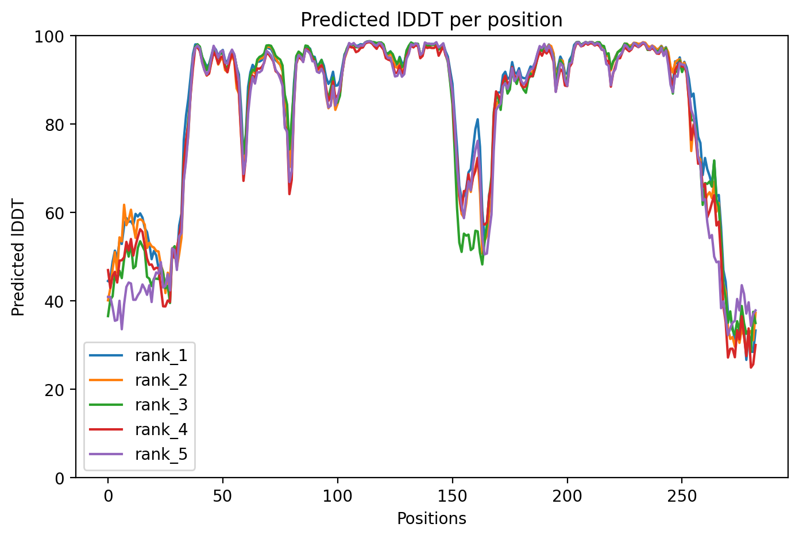
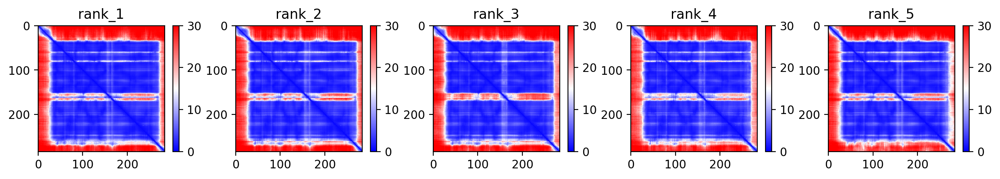
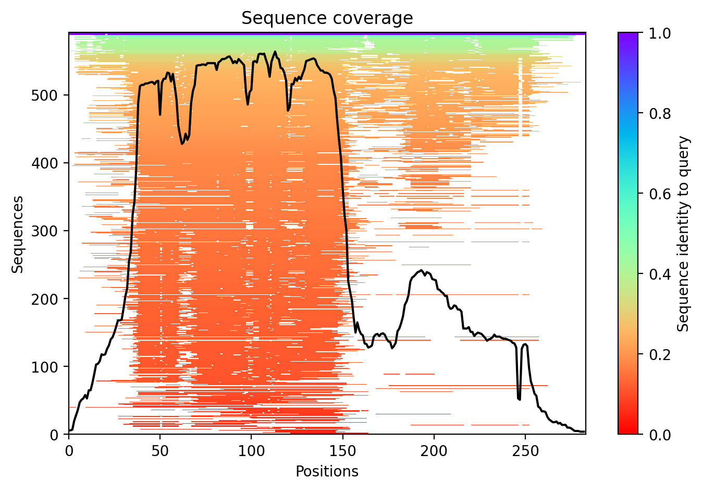

# Reporte de resultados modelando PFH55053 en AF2_COLABFOLD

El modelo rank_001 presenta un pLDDT promedio cercano a 83, lo que indica buena confianza estructural en la región central de la proteína. 
Los valores bajos (<50) en los extremos sugieren regiones intrínsecamente desordenadas o flexibles. El pTM = 0.80 respalda una topología
global confiable.

# Plots 
Figuras generadas por AF2_colab

# predicted Local Distance Difference Test (pLDDT)

**Representa la confianza estructural asignada a cada residuo en el modelo predicho.**
(Evalúa confianza geométrica local.)

El mapa de pLDDT muestra un núcleo globular con alta confianza estructural (región azul), mientras que los extremos presentan valores bajos, lo que sugiere regiones flexibles o potencialmente desordenadas. 

# Predicted Aligned Error (PAE)

**Estimación del error posicional entre pares de residuos en la estructura predicha.**

La matriz PAE presenta un bloque definido en la diagonal, lo que sugiere la presencia de un dominio estructural principal. Los valores elevados en los extremos reflejan incertidumbre en su orientación relativa, consistente con los bajos valores de pLDDT.

# Cobertura del MSA (Multiple Sequence Alignment)
**Profundidad del alineamiento múltiple de secuencias a lo largo de la proteína.**

La gráfica de cobertura del MSA muestra alto soporte evolutivo en la región central (~residuos 40–150), con más de 500 secuencias homólogas alineadas. En contraste, los extremos presentan menor profundidad, lo cual es consistente con la menor confianza estructural observada en el pLDDT. La predominancia de homólogos de identidad moderada-baja sugiere que la proteína pertenece a una familia estructural conservada con diversidad evolutiva.

